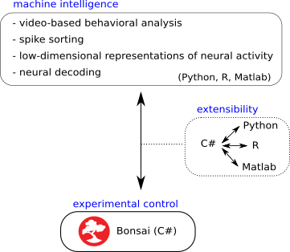
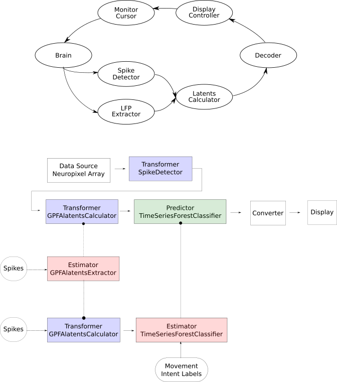

# Main repository for the Bonsai-ML project

The goals of the Bonsai Machine Learning project are:

1. allow Bonsai to communicate with software packages written in other
languages (Figure 1, middle),

2. integrate into Bonsai machine learning algorithms for behavioral and neural
data analysis (Figure 1, top),

    

    *Figure 1: interfacing Bonsai with other languages (middle) and inegrating machine learning algorithms into it (top).*

3. develop a Bonsai brain computer interface framework (Figure 2).

  

  *Figure 2: brain-computer interface framework to be built into Bonsai*
